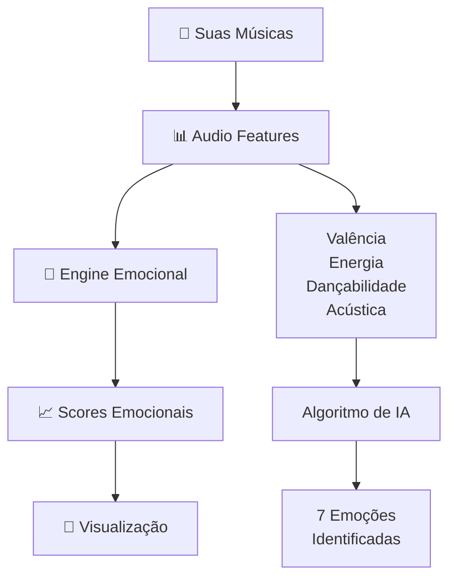

<div align="center">

# 🎵 **Emotify** 
### *Descubra as emoções por trás da sua música*


---

*Transforme seus dados do Spotify em insights emocionais profundos*

</div>

## 🌟 **O que é o Emotify?**

> **Emotify** é uma aplicação revolucionária que analisa seus hábitos musicais do Spotify e revela o **DNA emocional** das suas músicas favoritas. Descubra padrões ocultos, entenda seus estados de espírito através da música e conecte-se com pessoas que compartilham sua vibe musical.

<div align="center">

---

## ✨ **Funcionalidades Principais**

<div align="center">

| 🎯 **Análise Emocional** | 🎵 **Dados Reais** | 👥 **Social** | 📊 **Insights** |
|:---:|:---:|:---:|:---:|
| Algoritmo de IA que analisa valência, energia e dançabilidade | Integração completa com Spotify Web API | Conecte-se com pessoas de gosto musical similar | Visualizações interativas dos seus padrões |
| 7 emoções diferentes identificadas | Top músicas, histórico real, audio features | Crie e compartilhe playlists colaborativas | Timeline emocional semanal |

</div>

### 🚀 **Principais Features**

```typescript
🎵 Análise Emocional Avançada
├── 🧠 Engine de IA para processamento emocional
├── 📈 7 categorias emocionais (Alegria, Melancolia, Nostalgia, etc.)
├── ⚡ Análise de energia, valência e dançabilidade
└── 📊 Insights personalizados baseados em seus dados

🎶 Integração Real com Spotify
├── 🔐 OAuth 2.0 seguro
├── 🎵 Top músicas por período (curto/médio/longo prazo)
├── ⏰ Histórico de reprodução em tempo real
└── 🎨 Criação de playlists diretamente no Spotify

👥 Recursos Sociais
├── 🤝 Matching por compatibilidade musical
├── 🎵 Playlists colaborativas
├── 📱 Feed de atividades dos amigos
└── 🌍 Descoberta de novos usuários

📱 Interface Moderna
├── 🎨 Design inspirado no Spotify
├── 📱 Totalmente responsivo
├── ⚡ Animações fluidas com Framer Motion
└── 🌙 Suporte a tema escuro/claro
```

---

## 🛠️ **Stack Tecnológica**

<div align="center">

### **Frontend** 


### **Backend**


### **APIs & Integrações**


</div>

---

## 🚀 **Instalação e Configuração**

### **Guia Rápido (5 minutos)** ⚡

```bash
# 1. Clone e instale
git clone <seu-repositorio>
cd emotify
npm install

# 2. Configure backend
cp .env.example .env
# Edite .env com suas credenciais

# 3. Configure frontend
cd Front
npm install
cp .env.example .env.local
# Edite .env.local

# 4. Execute
# Terminal 1: npm run dev
# Terminal 2: cd Front && npm run dev
```

### **Documentação Completa** 📚

- 📖 **[Guia Rápido](QUICKSTART.md)** - Comece em 5 minutos
- 🚀 **[Guia Completo de Instalação](SETUP.md)** - Passo a passo detalhado
- 📡 **[Documentação da API](API.md)** - Referência completa da API
- 🛠️ **[Comandos Úteis](COMMANDS.md)** - Comandos para desenvolvimento
- 📁 **[Estrutura do Projeto](STRUCTURE.md)** - Organização de pastas
- 🚀 **[Guia de Deploy](DEPLOYMENT.md)** - Como colocar em produção
- 🤝 **[Como Contribuir](CONTRIBUTING.md)** - Guia de contribuição
- 📊 **[Resumo Executivo](PROJECT_SUMMARY.md)** - Visão geral técnica

### **Pré-requisitos**
- Node.js 18+
- Conta no [Spotify for Developers](https://developer.spotify.com/dashboard)
- Conta no [Supabase](https://supabase.com)

<div align="center">

🎉 **Acesse:** `http://localhost:3000`

</div>

---

## 📸 **Screenshots**

<div align="center">

### 🏠 **Dashboard Principal**


### 📊 **Análise Emocional**


### 👥 **Área Social**


</div>

---

## 🎯 **Como Funciona a Análise Emocional**

<div align="center">


```mermaid
graph TD
    A[🎵 Suas Músicas] --> B[📊 Audio Features]
    B --> C[🧠 Engine Emocional]
    C --> D[📈 Scores Emocionais]
    D --> E[🎨 Visualização]
    
    B --> F[Valência<br/>Energia<br/>Dançabilidade<br/>Acústica]
    F --> G[Algoritmo de IA]
    G --> H[7 Emoções<br/>Identificadas]
```

</div>

### **Emoções Detectadas:**
- 😊 **Alegria** - Músicas positivas e energéticas
- 😢 **Melancolia** - Faixas introspectivas e melancólicas  
- 💭 **Nostalgia** - Sons que evocam memórias
- 😌 **Calma** - Músicas relaxantes e tranquilas
- 🎉 **Euforia** - Tracks para dançar e celebrar
- 🤔 **Introspecção** - Músicas para reflexão
- ⚡ **Energia** - Faixas que te fazem mover

---

## 🤝 **Contribuindo**

<div align="center">

Adoramos contribuições! 🎵

</div>

### **Como contribuir:**

1. **Fork** o projeto
2. Crie uma **branch** para sua feature (`git checkout -b feature/AmazingFeature`)
3. **Commit** suas mudanças (`git commit -m 'Add some AmazingFeature'`)
4. **Push** para a branch (`git push origin feature/AmazingFeature`)
5. Abra um **Pull Request**

### **Áreas que precisam de ajuda:**
- 🎨 Melhorias no design/UX
- 🧠 Algoritmos de análise emocional
- 🌐 Internacionalização
- 📱 App mobile (React Native)
- 🔧 Otimizações de performance

---

## 📄 **Licença**

<div align="center">

Este projeto está sob a licença **MIT**. Veja o arquivo [LICENSE](LICENSE) para mais detalhes.

---

### 🎵 **Feito com ❤️ e muita música**


**Desenvolvido por:** [Seu Nome](https://github.com/seu-usuario)

</div>

---

<div align="center">

### 🌟 **Se você gostou, deixe uma estrela!** ⭐


</div>
